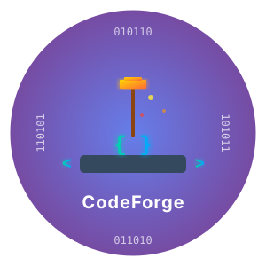
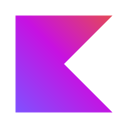
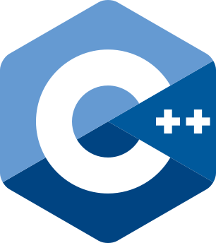
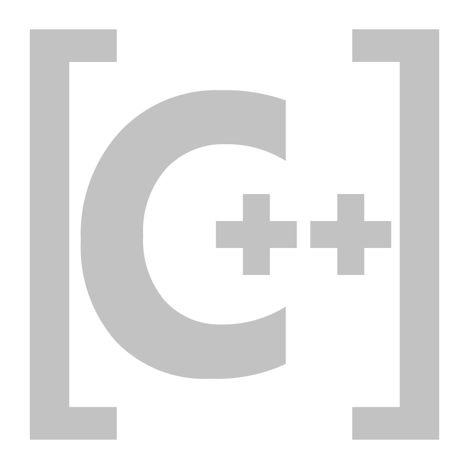
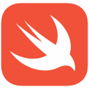

<div align="center">


<h1 style="margin-top: -10px;">CodeForge</h1>

**一款现代化的桌面端多语言代码编辑器与运行器**

集「文件/项目编辑 · 一键运行 · AI 助手 · Git 集成 · 集成终端 · 结构化数据可视化」于一身，
让你在一个轻量优雅的桌面应用里完成编写、运行、调试与协作。

<p>
  
  
  
  
</p>
</div>

---

## 📹 演示视频

[下载演示视频](https://devlive-cdn.oss-cn-beijing.aliyuncs.com/applications/codeforge/codeforge.mp4)（点击下载或观看）

> GitHub 不支持直接播放视频，请下载或点击链接查看。

---

## ✨ 核心功能

### 📂 编辑与项目
- **文件树侧栏 + 多标签编辑** —— 打开文件夹，像 IDE 一样浏览、编辑整个项目
- **面包屑路径导航** —— 点击任意层级在系统文件管理器中定位
- **命令面板**（`Cmd/Ctrl + Shift + P`）—— 一处入口直达所有命令
- **快速打开**（`Cmd/Ctrl + P`）—— 模糊匹配 + 最近文件优先
- **符号大纲**（`Cmd/Ctrl + Shift + O`）、**跳转到行**（`Cmd/Ctrl + G`）
- **代码片段** —— 自定义前缀，输入后按 `Tab` 展开（`$0` 为光标落点）
- **LSP 语义能力** —— 接入语言服务器，提供精准补全、悬浮文档、跳转定义、查找引用、重命名与实时诊断（需本机安装对应语言服务器，未安装则自动回退，不影响编辑）
- **会话恢复** —— 重启自动恢复上次的文件夹与标签页
- **深色模式** —— 跟随系统 / 浅色 / 深色，编辑器主题同步切换

### ▶️ 运行与调试
- **一键运行 / 按文件就地运行**，实时流式输出、执行耗时统计
- **运行选中片段**（`Cmd/Ctrl + Shift + Enter`）
- **监听模式** —— 保存后自动重跑
- **运行输入** —— 自定义参数 / stdin / 环境变量，并按文件记忆
- **执行历史** —— 持久化保存，可一键重跑与还原

### 📊 结构化数据可视化
- **JSON / XML / YAML** —— 可折叠**层级树**，以及卡片 + 连线的**关系图**两种可视化
- **SQL** —— 插件式执行器（内存库 / `.sqlite` 文件 / **MySQL** / **PostgreSQL** / **ClickHouse** / **DuckDB**，可在设置中配置连接、运行时选择数据源），结果渲染为**表格**，失败显示具体错误；执行历史与实时运行一致
- **图表可视化** —— SQL 结果一键切换为图表：**拖拽**字段到「维度 / 指标」即可成图，自动识别数值列，支持聚合（求和/计数/平均/最大/最小）、排序、Top N。基于 ECharts，内置 **27 种**图表：柱状图 · 折线图 · 面积图 · 饼图/环形图 · 玫瑰图 · 散点图 · 涟漪散点图 · 雷达图 · 漏斗图 · 热力图 · 仪表盘 · 桑基图 · 关系图 · 旭日图 · 矩形树图 · 树图 · 箱线图 · K 线图 · 平行坐标 · 主题河流 · 日历热力图 · 极坐标柱状图 · 象形柱图 · 词云 · 水球图 · 中国地图 · 世界地图（配色跟随主题，支持导出 PNG）。配置面板表驱动，组件与数据源解耦，后续 CSV 等本地数据可复用
- **CSV / TSV** —— 解析为**数据表**（支持引号转义、字段内换行、自动识别分隔符、Web Worker 后台解析 + 进度），并可一键切换为上述 27 种图表（与 SQL 共用图表面板）
- **Excel（.xlsx / .xls）** —— 用 SheetJS 解析，**多工作表**切换，同样可切表格 / 27 种图表 / 导出 CSV
- **Markdown** —— 实时渲染预览（支持内嵌 HTML，DOMPurify 净化防 XSS）
- **GitHub Actions 工作流** —— 自动识别并渲染为 **Jobs 依赖 DAG 图**（触发事件 → 各 Job → Steps）

### 🤖 AI 助手
- **多服务商** —— Claude (Anthropic) / OpenAI / DeepSeek
- **AI 代码预测** —— 编辑器内幽灵补全，`Tab` 接受
- **解释代码 / 生成测试 / 格式化代码** —— 一键发起，应用前可 diff 预览确认
- **报错分析、自然语言生成代码、生成 Git 提交信息**
- **对话与执行历史绑定** —— 每次执行的 AI 讨论可追溯

### 🔱 Git 集成
- **源代码管理面板** —— 暂存 / 提交 / 推送 / 分支切换，AI 一键生成提交信息
- **文件树状态徽标**（M / A / D / U）
- **编辑器行内差异标记** —— 相对 HEAD 的增 / 改 / 删

### 🔎 搜索与终端
- **文件夹内搜索与替换**（`Cmd/Ctrl + Shift + F`）
- **集成终端** —— 真实 shell、多标签、可拖拽改高度（`` Cmd/Ctrl + ` ``）

---

## 🧩 支持的语言

可运行语言均采用**插件化架构**，每种语言独立实现；JSON / XML / YAML / Markdown / CSV / TSV / Excel / 纯文本为编辑与可视化类型。

<div align="center">
  
  
  
  
  
  
  
  
  
  
  
  
  
  
  
  
  
  
  
  
  
  
  
  
  
  
  
  
  
  
  
  
  
  
  
  
  
  
  
  
  
  
  
  
  
  
</div>

<div align="center">

`Python` · `Node.js` · `TypeScript` · `JavaScript` · `React` · `Vue` · `Go` · `Rust` · `Java` · `Kotlin` · `Scala` · `Groovy` · `Clojure` · `C` · `C++` · `Objective-C/C++` · `Swift` · `Dart` · `Ruby` · `Perl` · `PHP` · `R` · `Julia` · `Lua` · `Haskell` · `OCaml` · `Cangjie` · `Shell` · `PowerShell` · `AppleScript` · `SQL` · `HTML` · `CSS` · `Less` · `SVG` · `JSON` · `XML` · `YAML` · `Markdown` · `CSV` · `TSV` · `Excel` · `Text`

</div>

---

## 🚀 安装与构建

**环境要求：** Node.js 22+ · Rust 1.8+ · pnpm

```bash
# 克隆项目
git clone https://github.com/devlive-community/codeforge.git
cd codeforge

# 安装依赖
pnpm install

# 开发模式
pnpm tauri dev

# 构建应用
pnpm tauri build
```

---

## 🛠 技术栈

| 层 | 技术 |
| --- | --- |
| 前端 | Vue 3 · TypeScript · Tailwind CSS · CodeMirror 6 · ECharts |
| 后端 | Rust · Tauri 2（rusqlite · mysql · postgres · clickhouse(HTTP)） |
| 存储 | SQLite（执行历史 / AI 对话 / 代码片段 / 应用配置统一入库） |
| 架构 | 插件化语言支持系统 · 插件式数据库执行器 · 可复用图表组件 · LSP 桥接 |

> **LSP 语言服务器**（可选，按需安装）：Python `pyright`、TS/JS `typescript-language-server`、Rust `rust-analyzer`、Go `gopls`、C/C++ `clangd`、Lua `lua-language-server`、PHP `intelephense`、Ruby `solargraph`、HTML/CSS/JSON `vscode-langservers-extracted`。未安装的语言会自动跳过 LSP，仅用基础高亮 + AI 预测。

---

## 🤝 贡献与反馈

欢迎提交 Issue 与 PR：<https://github.com/devlive-community/codeforge/issues>

## 📄 许可证

[MIT License](LICENSE)
