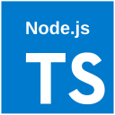

<div align="center">


<h1 style="margin-top: -20px;">CodeForge</h1>

CodeForge 是一款轻量级、高性能的桌面代码执行器，专为开发者、学生和编程爱好者设计。
</div>

## 演示视频

📹 [下载演示视频](https://devlive-cdn.oss-cn-beijing.aliyuncs.com/applications/codeforge/codeforge.mp4) (点击下载或观看)

> 注：由于 GitHub 不支持直接播放视频，请下载或点击链接查看

## 特性

- 🚀 **即时执行** - 一键运行代码
- 💻 **现代界面** - 简洁优雅的用户体验
- 📝 **智能编辑** - 代码高亮、行号、自动缩进
- 📊 **执行监控** - 实时显示执行时间和结果
- 🔧 **插件架构** - 可扩展的语言支持系统

## 支持的语言

<div style="display: flex; align-items: center; justify-content: center;">
  
  
  
  
  
  
  
  
  
  
  
  
  
  
  
  
  
  
  
  
  
  
  
  
  
  
</div>

## 安装

**系统要求：**

- Node.js 18+
- Rust 1.8+
- Tauri 2.x
- Vue 3.x

**构建步骤：**

```bash
# 克隆项目
git clone https://github.com/devlive-community/codeforge.git
cd codeforge

# 安装依赖
pnpm install

# 开发模式
pnpm tauri dev

# 构建应用
pnpm tauri build
```

## 技术栈

- **前端：** Vue 3 + TypeScript + Tailwind CSS
- **后端：** Rust + Tauri
- **架构：** 插件化语言支持系统

## 许可证

MIT License